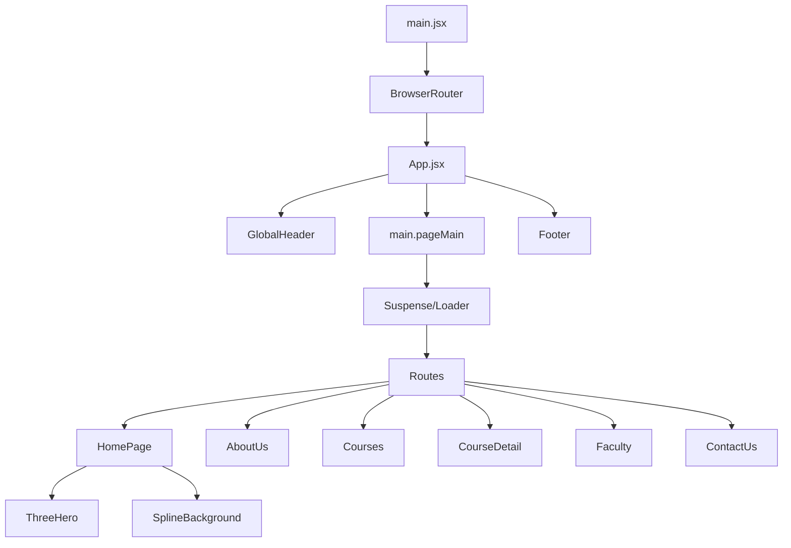

# Project Documentation: JD Edge Education Forum

Welcome to the comprehensive documentation for the **JD Edge Education Forum** project. This document provides a deep dive into the project's architecture, components, data models, and technical implementations.

---

## 1. Project Overview & Tech Stack

The JD Edge Education Forum is a modern, responsive React application built for an educational platform. It features premium 3D integrations and a modular component architecture.

### **Core Technologies**
- **Framework**: [React 18](https://reactjs.org/) (Functional Components & Hooks)
- **Build Tool**: [Vite 5](https://vitejs.dev/) - Fast development and optimized production builds.
- **Routing**: [React Router 6](https://reactrouter.com/) - Client-side navigation with dynamic routing.
- **3D Graphics**:
  - [@react-three/fiber](https://github.com/pmndrs/react-three-fiber) - React bridge for Three.js.
  - [@react-three/drei](https://github.com/pmndrs/drei) - Helper gallery for React Three Fiber.
  - [@splinetool/react-spline](https://github.com/splinetool/react-spline) - Integration for Spline 3D scenes.
- **Styling**: Vanilla CSS with a global design system and component-level modular styles.

---

## 2. Architecture & Component Hierarchy

The project follows a component-based architecture where UI elements are isolated into reusable blocks stored in `src/components/`, while full views are composed in `src/pages/`.

### **Component Hierarchy**



---

## 3. Navigation & Routing

The application uses **React Router** for seamless navigation. All major pages are **lazily loaded** to optimize initial bundle size, with a global `<Loader />` component serving as the fallback.

### **Route Map**

| Path | Component | Description |
|:---|:---|:---|
| `/` | `HomePage` | Introduction to JD Edge with 3D Hero. |
| `/about` | `AboutUs` | Company mission, vision, and history. |
| `/courses` | `Courses` | Searchable listing of all available programs. |
| `/courses/:slug` | `CourseDetail` | Dynamic page for specific course information. |
| `/why-jdedge` | `WhyJDEdge` | Unique value propositions of the platform. |
| `/results` | `ResultsTestimonials` | Student success stories and testimonials. |
| `/faculty` | `Faculty` | Bios and details of the teaching staff. |
| `/contact` | `ContactUs` | Contact form and location details. |
| `*` | `Navigate (to /)` | Fallback redirect for unknown paths. |

---

## 4. Key Components

### **4.1 GlobalHeader (`src/components/GlobalHeader`)**
Handles main navigation links and branding. It is persistent across all routes.

### **4.2 ThreeHero (`src/components/ThreeHero`)**
A premium 3D header component using **React Three Fiber**.
- **Features**: Features a floating Torus Knot with interactive `OrbitControls`.
- **Lighting**: Uses `Environment` from `@react-three/drei` for realistic "City" preset reflections.
- **Micro-animations**: Implemented using the `Float` utility for smooth, weightless movement.

### **4.3 SplineBackground (`src/components/SplineBackground`)**
Integrates complex 3D scenes exported from [Spline](https://spline.design/).
- **Props**: Accepts `sceneUrl` and `mode` ("fixed" for full screen or "section" for container-bound).
- **Overlay**: Includes a subtle CSS overlay for improved text readability over 3D scenes.

---

## 5. Data Layer

The project maintains its core content in a centralized data file: `src/data/coursesData.js`.

### **Courses Data Model**
Each course object includes:
- `slug`: Unique identifier for URL routing.
- `category`: Categorization (Capsule, Monthly, Year-long, etc.).
- `details`: Rich metadata including `overview`, `whoFor`, `examFormat`, and `benefits`.

---

## 6. Technical Implementation Details

### **3D Optimization**
To ensure high performance:
- 3D components are wrapped in `<Suspense>` to prevent blocking the UI during asset loading.
- Device Pixel Ratio (`dpr`) is constrained to `[1, 2]` to balance visual quality and GPU usage.

### **Host Allowance (Cloudflare Tunnels)**
The development server is configured in `vite.config.js` to allow `allowedHosts: true`, enabling seamless local project exposure via Cloudflare Tunnels without host header injection blocks.

---

## 7. Folder Structure

```text
jdedge-react-starter/
├── public/                 # Static assets (images, fonts, 3D models)
├── src/
│   ├── components/         # Reusable UI components
│   ├── data/               # Static data structures (e.g. coursesData.js)
│   ├── pages/              # Route-level components
│   ├── styles/             # Global CSS and themes
│   ├── App.jsx             # Main router and shell layout
│   └── main.jsx            # Application entry point
├── vite.config.js          # Vite configuration
└── package.json            # Dependencies and scripts
```

---

*Document generated by Antigravity AI.*
